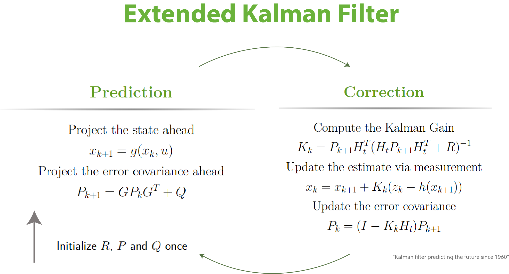
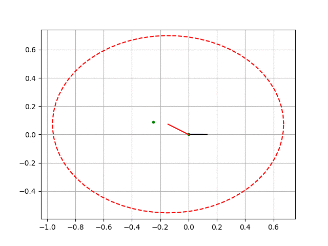

# Robotics Algorithms in Python

Implementation of various robotics sample algorithms for autonomous systems in Python.

# Requirements

- Python 3.6.x

- numpy

- pandas

- matplotlib

- scipy

# Installation

1. Install the required libraries.

2. Clone this repo.

3. Execute python script in each directory.

# Localization

## 1. Kalman Filter (KF) localization

Estimating the current state of a system given new observations and controls. 

Ref:- [PROBABILISTIC ROBOTICS](http://www.probabilistic-robotics.org/)

## 2. Extended Kalman Filter (EKF) localization
The EKF has become a standard technique used in a number of nonlinear estimation and machine learning applications. These include estimating the state of a nonlinear dynamic system, parameters of a nonlinear system identification (learning the weights of a NN) and dual estimation (Expectation Maximization (EM) algorithm) where both states and parameters are estimated simultaneously. The EKF can be viewed as providing 'first-order' approximation of the optimal terms. However, these approximations can introduce large errors in both the true mean and covariance of the transformed random variable leading to poor performance and sometimes divergence of the filter.

Ref:- [PROBABILISTIC ROBOTICS](http://www.probabilistic-robotics.org/)

## 3. Unscented Kalman Filter (UKF) localization
The UKF addresses the approximation issues of the EKF. The UKF does not only consider the mean and covariance but also consider set of points within the distribution. They kind of represent the shape of the covariance matrix. The UKF was originally designed for the state-estimation problem, and has been applied in nonlinear control applications requiring full-state feedback.

Ref:- [PROBABILISTIC ROBOTICS](http://www.probabilistic-robotics.org/)
## License 

MIT

